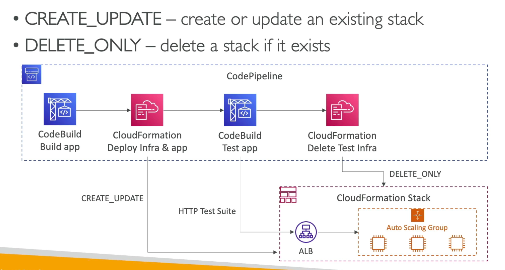

# CodePipeline - CloudFormation Integration
- Is a `deploy action` can be used to deploy AWS resources
- i.e. deploy lambda functions using CDK or SAM (alternative to CodeDeploy)
- Works with CloudFormation StackSets to deploy across multiple AWS accounts and AWS Regions
- Configure diff settings such as stack name, change set name, tempalte, params, iam role, action mode etc

### Example
- `CREATE_UPDATE` mode - create or update an existing cloudformation stack

CloudFormation
[CodePipeline]

CodeBuild builds app -> Cloud Formatoin Deploys Infra & app -> CREATE_UPDATE -> mutates CF live stack

Cloud Formatoin Deploys Infra & app -> runs test suite on the stack via HTTP (functional, load testing etc)

-> If all passes then also deploy to Prod via `CREATE_UPDATE` action

### CF as target
`Action Modes`
- Create or REplace aChange Set, execute achange set
- create or update s tack, delte a stack, repalce a failed stack
`Template Parameter Overrides`
- Specify a JSON object ot override param values
- Can be an input artifact for CodePipeline
- can be static (recommended) or dynamic
- all params must be present in the template