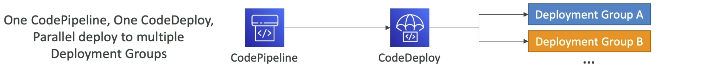
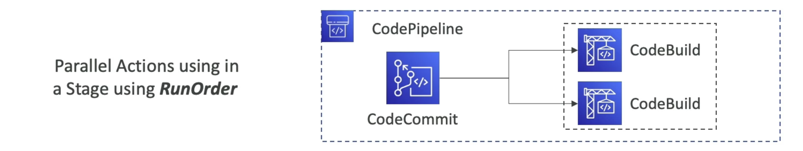
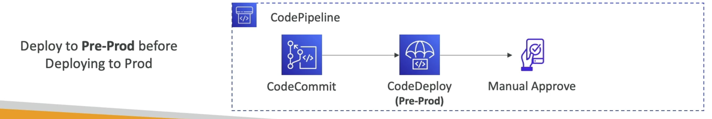
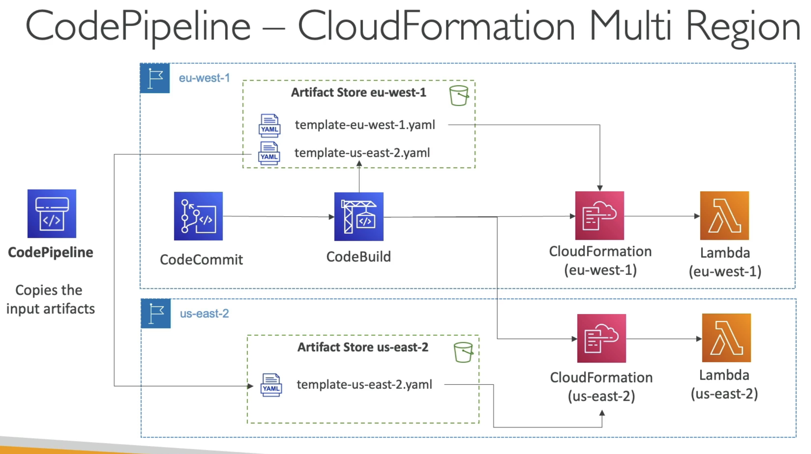

# CodePipeline - Best Practices

`One` CodePipeline, `One` CodeDeploy, `Parallel` deploy to multiple Deployment Groups

Parallel actions using a stage using RunOrder for parallelism

Deploy to pre-prod before deploying to prod

# CodePipeline & EventBridger
- detect and react to changes in execution states (i.e. intercept failures at certain stages)

# Arbitrary API call from Codepipeline
- best way to do this is via `Lambda` functions
- can also invoke `Step Functions` -> put item in DynamoDB, or start ECS task

# CodePipeline - Multi Region
- actions in pipeelien can be in different regions
- Example deploy S3 func through CF into multiuple regions
- `exam` s3 artifact stores must be defined in each region where you have actions
- so CodePipeline service role must have read/write access into every artifact bucket
- if you use console defaults buckets will be created, if you don't (CLI) you must make and configure them
- the nice `magic` is now we just specify the artifacts and CodePipeline will handle moving them between regions

# Diagram
The point is you need N artifacts (assuming 1 shared isn't sufficient) and N artifact stores per region
The artifacts need to live or be reachable where the CodeBuild instance is

