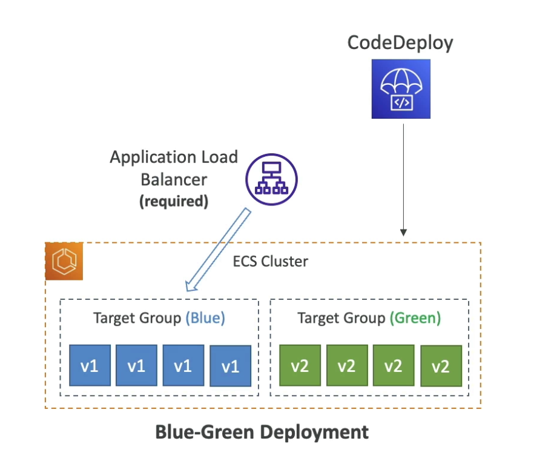

# CodeDeploy
- Deployment service that automates application deployment
- Deploy new application versions to EC2, On-prem, Lambda, or ECS Services
- Automated Rollback capability in case of failed deploymens, or trigger CloudWatch Alarm
- Gradual deployment control
- A file named `appspec.yml` defines how deployment happens

## EC2/On-prem platform deployment
- Perform in place deployments OR blue/green deploymenys
Must run `CodeDeploy Agent` on the target instances
Define Deployent speed
- All at once: most downtime
- Half at a time: reduces capcity by 50%
- One at a time, slowest, but lowest availability impact
- custom: own speed %

## Blue-Green
You ahve an ALB  with an ASG
in this pattern you will create a new ASG with the new app code
old ASG will get terminated, new one will replace it

## CodeDeploy Agent
- must be installed
- can be installed manually or automatically using Ssytems Manager
- EC2 instnaces must have sufficient permissions to access Amazon S2 to get deployment bundles (i.e. revisions are stored in S3)

## CodeDeploy - Lambda Paltform
- CodeDeploy cna help you automated tarffic shift for LAmbda aliases
Feature is integrated within the SAM framework

Ex.

PROD Alias -> 100% - X% traffic -> V1

PROD Alias -> X% traffic -> V2

X will grow a variety of ways
- `Linear` (i.e. 10% every 3 minutes)
- `Canary` (i.e. small amounts @ V2, then ramp up all to V2)
- `AllAtOnce` immediate

## CodeDeploy ECS - Platform
- CodeDeploy can help you automate the deployment of a new ECS Task Definition
- Only Blue/Green Deployments
- shift traffic based on a 100$ - X% pattern again
- Same strategies `Linear`, `Canary`, `AllAtOnce`
