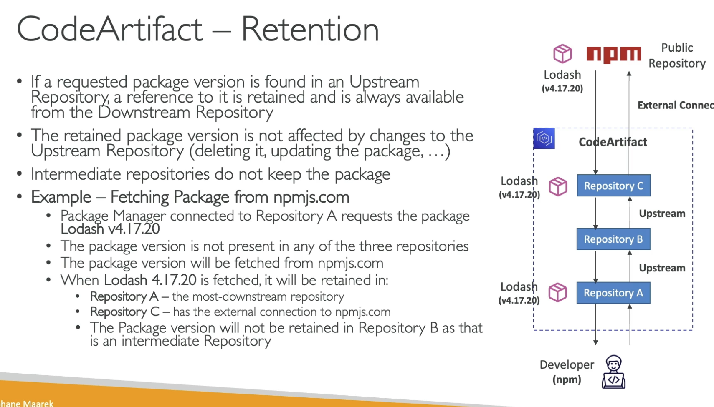

# CodeArtifact Upstream Repositories
- A CodeArtifact repo can have other CodeArtifact repos as Upstream Repositories
- Allows a pakcage manger client  can try to find the dpendencies in the upstreams, but with a single endpoint for the UX
- Repo A can be integrated with `npm` for example

# CodeArtifact External Connection
- A connection between a CodeARtifact Repository and an external/public repo, i.e. `npm`, `maven`, `pypi` etc
- Allows you to fetch packages that are not already present in your CodeARtifact repositoory
- A repository has a maximum of 1 external connection
Create many repositories for many external connections
- can cache public/extnerla results in your CodeArtifact repository

# CodeArtifact Retention
- If a requested package verion is found in an Usptreamm repo, a reference to it is retained ansi always available from the Downstream repo
- the retained package version is notaffected by changes to the Upstream repository (deleting it, updating it)
- Intermediate repos do not keep the packge
`REVISIT`

# CodeArtifact Domains
- Domains can span multiple accounts and repositories
- We define a single storage for all these repos (shared, de-duped storage)
- then all the repos just store a reference to the storage
- easier sahring and encryption with same AWS KMS key
- Fast copying

# Hands On
Remember package related policies are defined at the repo level

Can also created policies around the domain itself