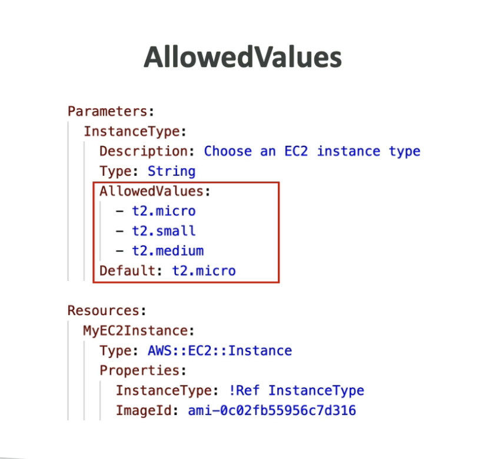
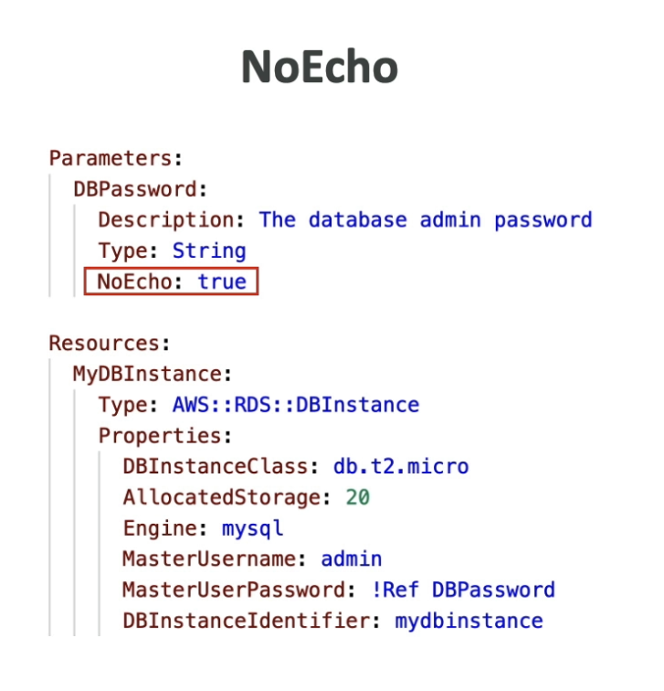

# CloudFormation Parameters
- Params are a way to provide inputs to your AWS CF templates
- Great for reuse, some information should be known ahead of time

## Should something be a parameter?
Is this likely to change in the future?
If yes make it a parameter
If not, do not

## Paremter settings
String, Number, CommaDelimitedList, List<Number>, AWS Specific PArameter, List<AWS-Specific PAramters>, SSM Parameter, Description, ConstraintDescriton, Min/MAx/Length,Default,Boolean etc

`EXAM`
AllowedValues


NoEcho

good for passwords

## How to Refernece a  Parameter

`!Ref` is the short hand in YAML or longly, `Fn:Ref`

Such as 
```yaml
...
        SecurityGroups:
            - !Ref SSHSecurityGroup
            - !Ref HTTPSecurityGroup
```

## CloudFormation - Psuedo Parameters
- basically default variables that can be `!Ref`'d and exist by default
 `AWS::` `AccountId`/`Region`/`StackId`,`StackName`,`NotificationARNs`,`NoValue`

 So you can use something like `AWS::Region` and it is provided/selfaware