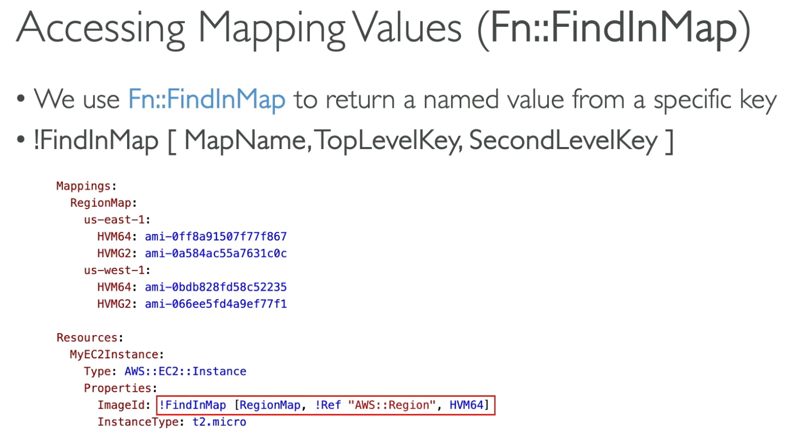

# CF Mappings
- Fixed varaibles within your CF template
- Helpful for diffentiating between differeent environments (dev vs prod), regions, AMI types etc
- These are `hardcodd`

## Accessing Mapping Values (`FN::FindInMap)`

Mappings are great when you know in advance all the values that can be taken and they can be deduced from varaibles like region, AZ, AWS Account, Environment etc...

Parameters are more flexible general inputs