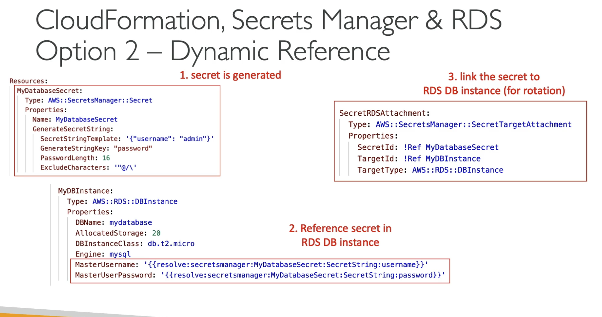

# CF Dynamic References
- We can store values in System Manager Parameter Store (SSM) or Secrets Manager within CloudFormation templates

Supports
- SSM for plaintext values
- SSM-secure for secure strings in SSM PArameter Store
- secretsmanager for secret valeus in Secrets Maanger

### Syntax
```yaml
{{resolve:ssm:parameter-name:version}}
# Or
{{resolve:ssm-secure:parameter-name:version}}
# Or
{{resolve:secretsmaanger:secret-id:secret-string:jsonkey:version-stage:version-id}}
```

## `ManageMasterUserPassword`
`EXAM`
- If we create something like an RDS MySQL database, if we use `MangeMasterUserPassword: true` attr then the password will get created in `Secrets Manager` implicitly

Then use
```yaml
Value: !GetAtt MyCluster.MasterUSerSecret.SecretArn`
```

OR make an actual secret resource in your CF template, then resolve that created secret for the instance that needs it


The nadd a SecretRDSAttachment style resource that links these for rotation of `Type: AWS::SecretsManager::SecretTargetAttachment`

This will allow dynamic auto rotation