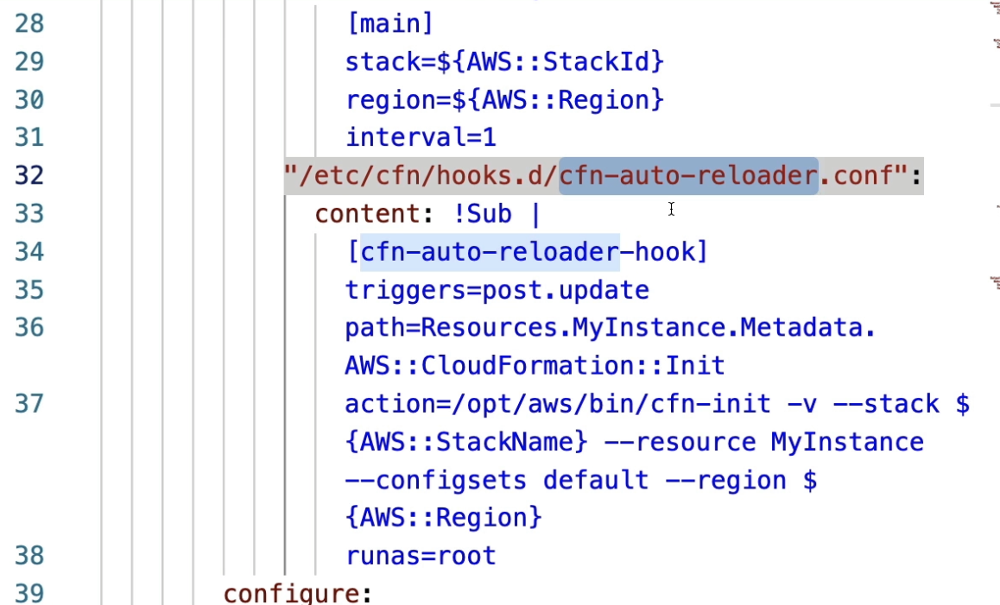

# cfn-hup
- Can be used to tell your EC2 instance to look for Metadata changes every 15 minutes and apply the Metadata config again

- Relies ona ` cfn-hup` config files, see `/etc/cfn/cfn-hup.conf` and `/etc/cfn/hooks.d/cfn-auto-reloader.conf`

I.e. if the metadata changes then re-run `cfn-init` (the user data)

Example: remember metadata is a a generic field that has special meanings for hooks like `cfn-init` or `cfn-hup`
```yml
Resources:
  MyInstance:
    Type: AWS::EC2::Instance
    Metadata:
      AWS::CloudFormation::Init:
        config:
          packages:
            yum:
              httpd: []
          services:
            sysvinit:
              httpd:
                enabled: true
                ensureRunning: true
```