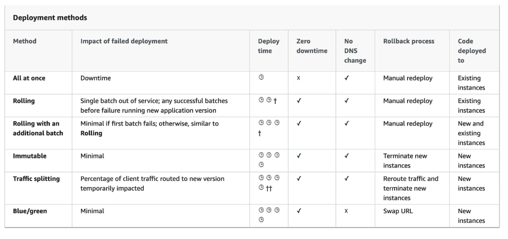

# Beanstalk Deployment Options

* `All at once` – Deploy to all instances simultaneously. **Fastest**, but causes downtime while instances are updated. No Additional Cost.

* `Rolling` – Update instances in batches. Some instances continue serving traffic while others are updated. No Additional Cost.

`EXAM`
* `Rolling with additional batches` – Launch temporary extra instances so full capacity is maintained while updating batches. No reduced capacity during deployment. You do this to ensure minimum capacity requirements (i.e. N instances of application X, rather than N/2 old running next to N/2 new during the update) `Additional cost` 

* `Immutable` – Launch a **new Auto Scaling group (ASG)**, deploy and validate the new version there, then replace the old instances if healthy. Safest option for updates to the same environment. Zero down time. `Additional Cost` (double the capcity)

* `Blue/Green` – Create an entirely **new Beanstalk environment** running the new version, then switch traffic (typically by swapping CNAMEs). Easy rollback by switching back.
* `Traffic splitting (Canary)` – Send a small percentage of traffic to the new version first. If healthy, gradually shift all traffic to the new version.
Not directly a Beanstalk feature but you can implement this pattern. Additional Cost. (Can use Route53 to control traffic through environments)

## Elastic Beanstalk - Traffic Splitting
- Canary Testing
- New application version is deployed to a temporary ASG with the same capcity
- A small % of the traffic is sent to the temp ASG for a configurable amount of time
- Deployment health of new temp ASG is monitored. Can trigger quick automated rollback
- No application downtime
- Once stable instances in the temporary ASG get moved in to the Main ASG

All of this is `EXAM` relevant revisit

