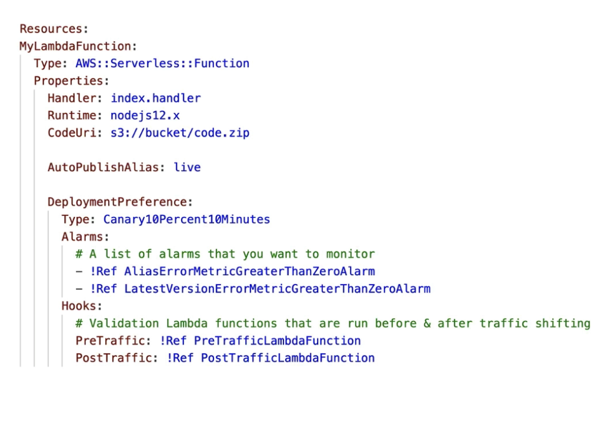

# SAM and CodeDeploy
- SAM framework natively uses CodeDeploy to update Lambda functions
- Traffic shifting feature
- Pre and Post traffic hooks features to validate deployment (before the traffic shift starts and after it ends)
- Easy & autoamted rollback using CloudWatch Alarms

Important attriutes
- `AutoPublishAlias` detects when new code is being deployed
- Creates and publishes an udpated version fo that function with the latest code
- Point the alias to the update version of the Lambda function

`DeploymentPreference`
- Canary, Linear,AllAtOnce

Alarms
- Alarms that can trigger a rollback
Hooks
- Pre and post traffic shifting lambda functions
