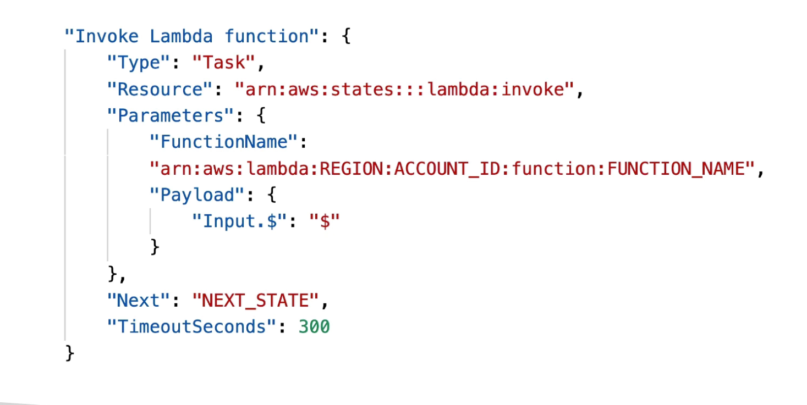

# AWS Step Functions
- Model your workflow as state machine (one per workflow)
- order fulfillment, data processing
- web applications, any workflow
- written in JSON
- Visulization of the workflow and the execution of the workflow, as well as history

Think of process flow diagrams

Can start a workflow with SDK call, API, Gateway, Event Bridge, Manual etc.

## Step Function Tasks STates
- task state definition: i.e. do some work in your state machine
    - Invoke one AWS service
    - I.e. write to DynamoDB

or

- run an activity
- EC2, Activities poll the step functions for worker
- Aopp server polls for works, sends results to Activity Task

## Example - Invoke Lanmbda Function

## Step Function - States
- Choice State - test for a condition to send to a branch 
- Fail or Succeed State - stop execution with fail or OK
- Pass State - simply pass input to its ouytput or inject some fixed data
- Wait State - delay
- Map State - dynamically iterate state
- `Parallel State` `EXAM` - parallel execution
- `And Task State` ?

