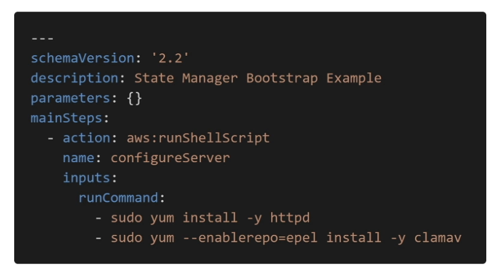

# SSM Documents and SSM Run Command

## SSM - Documents
- written in JSON or YALM
- define parameters
- define actions
- many docs exist in AWS
- can be used to run commands

or

- can be applied to other. features like state managers, patch maanger, automation, parameter store

## SSM - Run Command
- Execute a document (=script) or just run a command
- Run command across multiple instances using resource groups
- Rate control / error control
- Integrated with IAM and cloudtrail
- no need for SSH
- command output can be shown in console, send to to s3, or cloduwatch logs
- send notifications to SNS about command statues, in progress/success/failed
- Can be invoked using eventbrige
