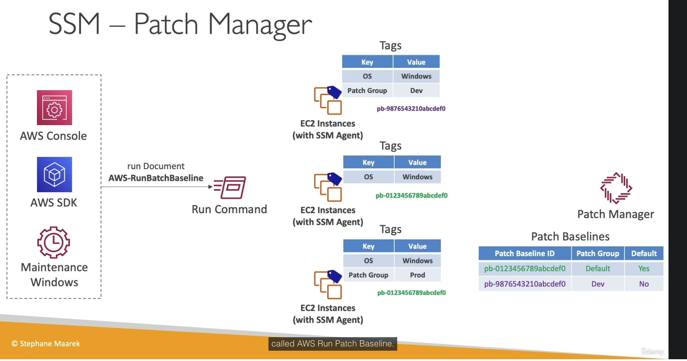

# SSM Patch Manager and Maintenance Windows
- automates the process of patching managed instances
- OS updates application updates security updates...
- supports ec2 and on prem
- linux, mac, windows
- on demand or on a window

1) Patch Baseline
- which patches should and shouldn't be installed on your instances
- ability to create custom patch baseline 
- patch can be auto-approved within days of their release
- by default install only critical patches and patches related to security

2) Patch Groups
- associate a set of instances with a speciifc patch baseline
- example create patch groups for differnt environments (Dev, test, prod)
- instances should be defined with the tag key `Patch Group`
- an instance can only be in one Patch Group
- Patch Group can be registered wit only one Patch Baseline

## Patch Baselines
- predefined patch baseline
- defined by AWS/managed

.
.
.
- custom patch baseline
- w

A patch baseline is basically an ID along with a patch group & default bool

# Maintenance Window
- self explanatory
- patch manger is used to patch instance, can be run within a specific maintenance window with rate control `EXAM`