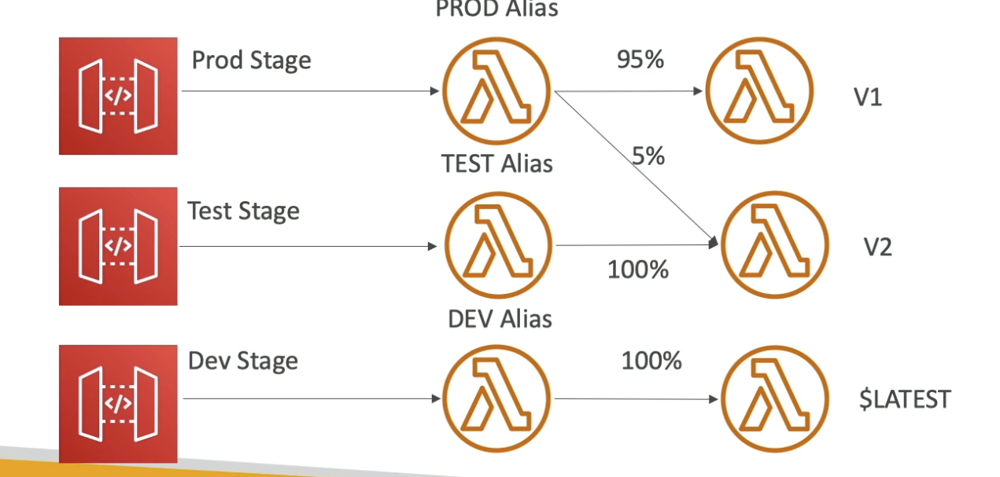

# API Gateway Stages and Deployment
- Making changes in the API Gateway does not mean they're effective
- You need to make a 
deployment" for them to be in effect
- it's a common source of confusion
- Changes are deployed to "Stages"
- Rollbacks, history, env (stage) varaibles all supported

## Stage Variable
- Stage vars are like env varaibles for API Gateway
- Use them to change often changing configuration values
- They can be used in:
- Lambdafunction ARN
- HTTP edpoint
- param mapping templates

Use Cases
- autoconfig HTTP ednpoints your stages talk to (i.e. dev, test, prd)
- pass config params to the AWAS lambda through mapping tempaltes
- stage variablesa re passed ot the `context` object in AWS Lambda

### Common Use Case
- Stage varaible that contains the corresponding lambda alias to invoke

