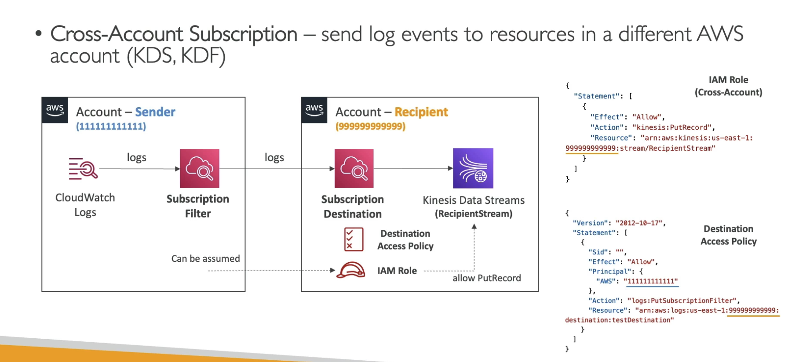

# CloudWatch Logs
- log groups: arbitrary name, usually representing an application
- log stream: instances witin a application / log files / containers
- can define log expiration poliies (never expire, 1 day to 10 years)
- CW logs can send logs to S3 (Export)
    - stream to KDS
    - KDF/ADF
    - AWS Lambda
    - OpenSearch
- Encrypted by default
- Can setup KMS-based encryption if desired

## Sources
- SDK, CW Logs Agent, CW Unified Agent (dedicated CW Log Agent is deprecated)
- Elastic Beanstalk:coleltion of log from app
- ECS: containers
- AWS Lambda: collection from function logs
- VPC Flow Logs: VPC specific lows
- API Gtteway
- CouldTrail filter
- Route 53 

## CW Logs Insight
- write a query, get a visualization
- almost ike SQL
- Search and analyze lgo data sotred in CW Logs
- Example find a specific IP inside a log, count occurences of "ERROR" in your logs
- Provides a purpose built query langauge
    - Automatically discover fields form AWS services and JSON log events
    - Fetch desired events/filters/aggregate
    - Can save queries and add them to CW dashboards

Query engine, NOT real time (historical only)

## S3 Export
- Log data can take up to 12 hours to become avaialble for export

## CW Logs Subscriptions
- Get real-time stream from CW Logs for processing and analysis
- Send to kinesis dat streams, KDF/ADF, Lambda
- Subscription Filter - which logs are events delivered to your destination

Can aggregate multiple account/region data into a single KDS instance `EXAM`

## CW Logs Subscriptions
- Cross-Account Subscription - send log events to resources in a differet AWS account (KDS, KDF)

