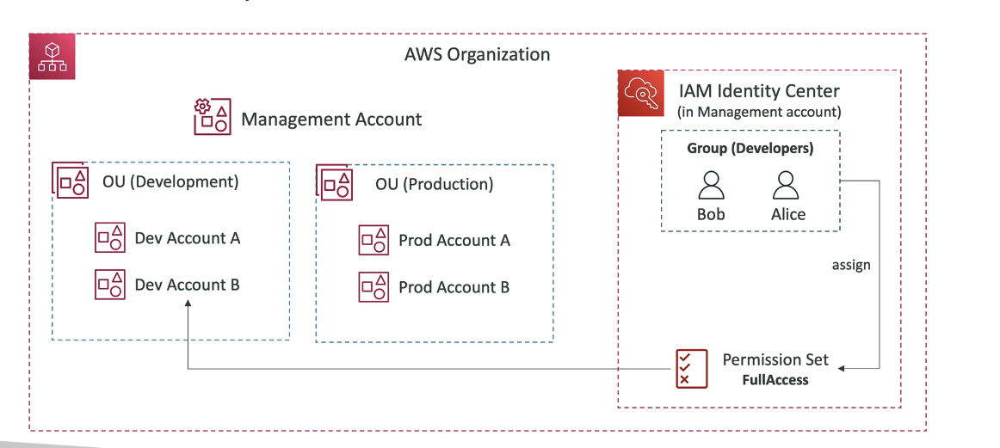

# IAM Identity Center
- SSO successor
- one login for all your
    - AWS accounts in an AWS Org
    - Business Cloud appliocations (SAlesforce, Box, Microsoft 365 etc)
    - Any SAML2.0-enabled aplpications
    - EC2 Windows Instances

`EXAM: one login to multilpe AWS accounts`

- Identity providers
    - built in store in IAM identity center
    - 3rd party Active Directory (AD), OneLogin, Octa

    100% reocmmended for multiple account environments

    Use Permission Sets to define what users have access to what
    - EX: have developers in a group in IAM, then you create a permission set and assign it to the devloper group and the target OU 

    

    ## FINE-GRAINED permissiosn and assignemnts
    - Multi Account Permissions
        - Manage access across AWS accounts in your AWS Org
        - Permission Sets: collection of one or more IAM policies assigned to users and groups to define AWS access

    - application assignments
        - SSO access to many SAML 2.0 business applications
        - Provide required URLs, certifcates, and metadata

    - Attribute-ased Access Control (ABAC)
        - Fine-grained perms based on user's attrs stored in IAM Identity Center Identity Store
        - Example: cost center, title, locale
        - Use casE: Define permissions once, then modify AWS access by chaning the attrs